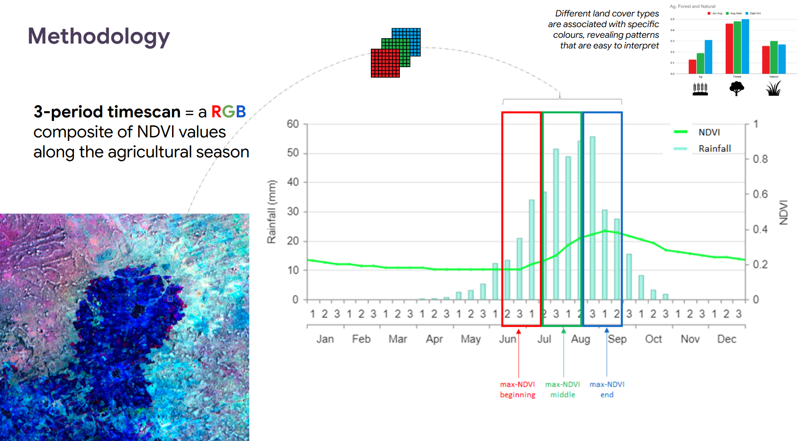
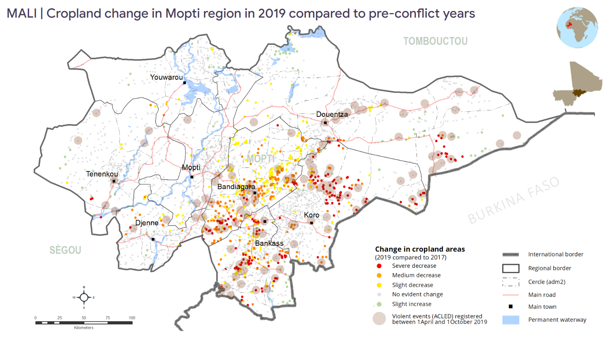

# s2-cropland-abandonment

Assessing conflict-driven cropland abandonment in Sahelian landscapes (here: central Mali) processing Sentinel-2 time-series in Google Earth Engine.

---

## Overview

Violent conflict disrupts agricultural systems in ways that are nearly impossible to document on the ground. This repository contains the remote sensing pipeline used to detect and categorize cropland abandonment across conflict-affected areas in central Mali, using Sentinel-2 multispectral imagery processed in Google Earth Engine. The methodology has since been replicated across similar environments (Burkina Faso, Niger, Nigeria, and Chad) from 2020 onwards.

The core product is the **3-Period TimeScan (3PTS)** — a Red-Green-Blue composite that encodes the maximum NDVI value at three distinct phases of the agricultural season into a single image per year. Active cropland appears in vivid colour; bare or abandoned land appears dark or grey. By comparing composites before and after the onset of violence, reductions in cultivated area become immediately visible at the locality level.

The analysis identified ~500 localities with significant cropland losses across the Mopti region in 2019, with a strong spatial correlation with ACLED-registered violent events. Results fed into the national food security framework (Cadre Harmonisé), contributing to the estimation of roughly 760,000 food-insecure persons for the 2020 lean season and targeting 65,000+ beneficiaries for early emergency assistance.

---

## Publication & Coverage

**Peer-reviewed paper:**

> **Boudinaud, L. and Orenstein, S. A. (2021)**  
> *Assessing Cropland Abandonment from Violent Conflict in Central Mali with Sentinel-2 and Google Earth Engine.*  
> ISPRS Archives, XLVI-4/W2-2021, pp. 9–16.  
> DOI: [10.5194/isprs-archives-XLVI-4-W2-2021-9-2021](https://isprs-archives.copernicus.org/articles/XLVI-4-W2-2021/9/2021/)  
> Presented at FOSS4G 2021 Academic Track.

**Practitioner write-up:**

> **Boudinaud, L., Kamara, N. and Ibrahim, A. (2021)**  
> *Using satellite imagery in conflict-affected areas in Mali to support WFP's emergency response.*  
> Field Exchange, Issue 64. [ennonline.net/fex/64/wfpsatelliteimagery](https://www.ennonline.net/fex/64/wfpsatelliteimagery)

**Media coverage:**

- [The Guardian](https://www.theguardian.com/global-development/2020/jul/10/a-drastic-loss-satellite-imagery-reveals-malis-farmers-forced-off-land-by-militias) — *"A drastic loss": satellite imagery reveals Mali's farmers forced off land by militias* (July 2020)
- [Le Monde](https://www.lemonde.fr/afrique/visuel/2021/01/24/dans-le-centre-du-mali-des-villages-rases-par-les-violences-et-la-famine_6067424_3212.html) — *Dans le centre du Mali, des villages rasés par les violences et la famine* (January 2021)

The original GEE script associated with the paper is archived at:  
[code.earthengine.google.com/c1c5529b8f9b997a8ec2afe12d3dc95d](https://code.earthengine.google.com/c1c5529b8f9b997a8ec2afe12d3dc95d)

---

## Study Area & Context

**Region:** Mopti, central Mali
**Period of analysis:** 2016–2022 (baseline 2016–2017; crisis onset 2018)

The Mopti region experienced a rapid escalation of violence from 2018, linked to the proliferation of armed groups and self-defence militias. The number of internally displaced persons (IPDs) in Mali grew from ~50,000 in March 2018 to nearly 240,000 two years later, more than half of whom in Mopti alone. In this context, conventional field-based agricultural surveys became impossible to conduct safely, creating a critical information gap at the moment it was most needed.

Sentinel-2 was selected because its 10-m spatial resolution allows to detect the small, non-mechanised fields that dominate the Sahelian landscape (98% of fields in Mali are below 1.5 hectares). No existing global LCLU dataset achieved sufficient accuracy: a comparison of eight datasets found none exceeding 75% accuracy for cropland in the Sahel, with an average overestimation of cultivated areas of 170%.

---

## Methodology

### The 3-Period TimeScan (3PTS)

Inspired by the TimeScan approach (Esch et al., 2018), the 3PTS encodes cropland phenology into a single RGB composite. Each band represents the maximum NDVI value across one of three sub-periods of the Sahelian agricultural calendar:

| Band | Period | DOY | Phenological phase |
|---|---|---|---|
| **R** | 15 Jun – 1 Aug | 166–213 | Land preparation / early growth |
| **G** | 2 Aug – 1 Sep | 214–244 | Peak growing season |
| **B** | 2 Sep – 15 Oct | 245–288 | Harvest |

Croplands are identified by their characteristic NDVI trajectory: low early in the season, rapidly rising to a peak, then sharply declining at harvest. This temporal signature produces vivid, distinct colours on the 3PTS composite. Natural vegetation shows lower variation and appears in grey tones. Settlements and bare ground appear black throughout.


*The 3-Period TimeScan encodes max-NDVI values at three phases of the study area's agricultural season into a single RGB composite.*

### Data

- **Sentinel-2 L1C** (top-of-atmosphere reflectance) was used in the original study rather than L2A, because L2A products were not systematically available in GEE for earlier years: 721 L1C vs 697 L2A tiles for the 2019 season; for 2016 and 2017, no L2A was available at all. A total of **2,039 Sentinel-2 tiles** were processed for the original analysis. The extended script in this repository uses `S2_HARMONIZED` with QA60 cloud masking.
- **NDVI** computed as `(B8 − B4) / (B8 + B4)` at 10 m resolution.
- **Populated places:** A dataset of **~ 3,200 georeferenced populated sites** in Mopti was constructed from the INSTAT 2009 national census village list as the authoritative national source (a requirement for alignment with government counterparts and integration into official frameworks). This was augmented with OCHA Common Operational Datasets, OpenStreetMap, HRSL (Facebook/CIESIN), Google Earth, and Sentinel-2 visual inspection to ensure full coverage. In contexts where alignment with national statistics is not required, an open-source database such as OSM or OCHA CODs alone would provide a sufficient and more readily replicable baseline.
- **ACLED** conflict event data (battles, violence against civilians, explosions/remote violence).

### Change detection

Rather than automated classification — which proved insufficiently reliable over the ecologically heterogeneous Sahelian landscape without adequate ground-truth — **visual interpretation** of 3PTS composites was used. The populated sites were assessed by comparing the 2019 composite against 2017 (and 2016 for confirmation if any doubt). Results were validated with VHR imagery where available (60% of localities). Each site was assigned one of five change classes:

| Class | Definition |
|---|---|
| Severe decrease | > 50% cropland loss detected |
| Medium decrease | 25–50% cropland loss |
| Slight decrease | < 25% cropland loss |
| No change | No detectable change |
| Slight increase | < 25% cropland gain |

### Key result (example)


*Cropland change in the Mopti region, 2019 vs. pre-conflict years and violent events*

---

## Quickstart

### GEE script

Open `gee/s2_3period_timescan.js` in the [GEE Code Editor](https://code.earthengine.google.com/).  
Edit the `CONFIGURATION` block at the top (commune, years, thresholds) and run.  

## Limitations

- Results are qualitative — the 3PTS does not quantify cropland surface area change directly
- Visual interpretation was retained over automated classification due to insufficient ground-truth samples and the ecological heterogeneity of the Sahelian landscape; supervised/unsupervised classifications were tested but could not achieve acceptable accuracy in operational timeframes
- The extended script adds cloud masking not present in the original analysis

---

## Citation

```bibtex
@article{boudinaud2021,
  author  = {Boudinaud, Laure and Orenstein, Sacha Alex},
  title   = {Assessing Cropland Abandonment from Violent Conflict
             in Central Mali with Sentinel-2 and Google Earth Engine},
  journal = {ISPRS Archives},
  volume  = {XLVI-4/W2-2021},
  pages   = {9--16},
  year    = {2021},
  doi     = {10.5194/isprs-archives-XLVI-4-W2-2021-9-2021}
}
```

---

## Contact

**Laure Boudinaud** | [github.com/laureboudinaud](https://github.com/laureboudinaud)  
laure@galateo-analytics.com | laure.boudinaud@gmail.com
*Formerly: WFP Regional Bureau of West and Central Africa, VAM Unit, Dakar*

---

## License

MIT License — see `LICENSE` for details.  
Sentinel-2 imagery: © ESA / Copernicus, CC BY 4.0.  
ACLED data: [acleddata.com](https://acleddata.com) — free for non-commercial research use with attribution.  
OSM data: © OpenStreetMap contributors, ODbL.

---

## Acknowledgements

This work was developed in the framework of a project on the detection of impacts of armed violence on food security and agriculture in hard-to-reach areas, implemented by WFP Mali Country Office in 2019-2021 and WFP Regional Bureau of West and Central Africa since 2021.
